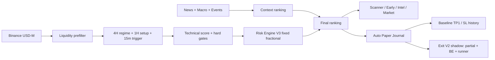

# Crypto Futures Terminal

Terminal riset dan pemantauan Binance USDⓈ-M Futures yang menggabungkan analisis teknikal multi-timeframe, data derivatif, konteks berita/makro, dan jurnal auto paper trade.

> **Status:** `Closed-Candle Evaluation V2 · Manual Execution Monitor · READ ONLY`<br>
> **Live:** https://crypto-futures-terminal.harfikoedvin.chatgpt.site<br>
> **Peringatan:** terminal tidak mengirim order uang asli. Score adalah skor aturan, bukan probabilitas profit. Eksekusi uang asli tetap manual di CEX.

## Tujuan proyek

Terminal dibuat untuk:

1. Menyaring pasar futures yang likuid.
2. Memisahkan setup siap-review, watchlist, dan indikasi early accumulation.
3. Menampilkan alasan numerik di balik setiap status.
4. Menjalankan paper trade otomatis untuk mengumpulkan bukti TP/SL.
5. Menjadi alat observasi dan evaluasi, bukan mesin rekomendasi yang dianggap pasti.

## Alur data



Konteks eksternal hanya menyesuaikan ranking. Ia tidak boleh menghapus kegagalan hard gate teknikal atau Risk Engine V3.

## Menu terminal

| Menu | Fungsi |
|---|---|
| **Scanner** | Trade Ready Top 5, Potential Watchlist, alasan setup, entry zone, SL, TP1–TP3, R:R, serta alasan gate gagal. |
| **Early** | Radar akumulasi awal berbasis divergence, volume, range compression, OI, taker ratio, funding, lokasi harga, dan reclaim 15m. |
| **Intel** | News impact Crypto/USDT, Fear & Greed, macro regime, event risk, dan odds Polymarket. |
| **Paper** | Akun simulasi $1.000, risiko terencana 2% equity per trade, sizing dinamis, posisi aktif, net P&L USD, progress ke TP/SL, evaluasi per model, dan riwayat hasil. |
| **Eval** | Jurnal shadow persisten, LONG/SHORT dan regime split, expectancy, profit factor, serta evidence gate KEEP/OBSERVE/REVERT. |
| **Market** | Prefilter likuiditas: harga, perubahan 24 jam, volume, spread, funding, dan alasan WAIT/READY. |

Grafik internal sengaja dihapus agar terminal lebih ringan. Setiap pair menyediakan tautan langsung ke TradingView.

## 1. Universe dan prefilter pasar

Terminal mengambil kontrak perpetual USDT aktif dan mengecualikan aset stablecoin tertentu. Batas utama saat ini:

| Parameter | Nilai |
|---|---:|
| Kandidat prefilter | maksimum 30 pair |
| Volume quote 24 jam minimum | 25 juta USDT |
| Spread maksimum | 6 bps |
| Funding absolut maksimum | 0,10% |
| Kandidat utama di layar | Top 5 |
| Siklus full scan | setiap 15 menit selama terminal terbuka |

Jika provider gagal, terminal tidak membuat kandidat palsu. Status berubah menjadi degraded/error dan hasil teknikal tidak dipaksakan.

## 2. Mesin setup multi-timeframe

Pembagian timeframe:

- **4H:** arah/regime utama.
- **1H:** struktur, momentum, lokasi, ATR, volume, dan rancangan setup.
- **15m:** konfirmasi trigger melalui arah MACD, posisi terhadap EMA21, dan RSI.

Tipe setup aktif saat ini:

- `Breakout`
- `Trend pullback`

### Komponen technical score saat ini

| Komponen | Poin maksimum |
|---|---:|
| Arah 4H sesuai arah trade | 25 |
| MACD histogram 1H searah | 8 |
| RSI 1H di rentang arah yang sehat | 6 |
| ADX minimal 18 | 6 |
| Struktur pasar searah | 12 |
| Breakout struktur searah | 8 |
| Relative volume minimal 0,75× | 9 |
| ATR di atas median terbaru | 6 |
| Taker buy/sell searah | 4 |
| OI 45 menit tidak turun | 4 |
| Funding mendukung | 4 |

Score dibatasi maksimum 100. Setiap komponen hanya menyumbang poin bila buktinya hadir — tidak ada poin dasar/fallback (audit P0 menghapus `+5` unconditional serta fallback +4/+3/+1).

### Hard gate Trade Ready

Setup hanya masuk Trade Ready jika seluruh kondisi berikut lolos:

- Tidak ada konflik arah antara 4H dan 1H.
- Sinyal dasar menghasilkan LONG atau SHORT, bukan NO TRADE.
- Technical score minimal 75.
- Konfirmasi 15m searah.
- ADX 1H minimal 20.
- Relative volume minimal 0,9×.
- Volume quote 24 jam minimal 25 juta USDT.
- Spread maksimum 6 bps.
- Funding tidak ekstrem.
- Perubahan OI 45 menit tidak negatif.
- Lokasi harga actionable dan trendline belum patah.
- Ekstensi dari EMA21 maksimum 2,5 ATR.
- Seluruh gate keselamatan Risk Engine V3 lolos.
- Tidak sedang berada dalam event blackout aktif.

Kandidat yang gagal satu atau lebih gate dipindahkan ke **Potential Watchlist**, disertai alasan kegagalannya.

## 3. Risk Engine V3 — Fixed Fractional

Risk Engine V3 mempertahankan SL dan TP dari struktur teknikal, lalu menyesuaikan ukuran posisi agar kerugian terencana—termasuk estimasi biaya round trip—maksimum 2% dari equity paper.

### Rumus utama

```text
riskBudgetUsd         = accountEquity × 2%
stopDistanceRate      = abs(entry - stopLoss) / entry
totalLossRate         = stopDistanceRate + 0,10%
notionalUsd           = riskBudgetUsd / totalLossRate
safeLeverage          = min(20, floor(0,70 / stopDistanceRate))
marginUsd             = notionalUsd / safeLeverage
estimatedLossAtStop   = notionalUsd × totalLossRate
```

### Gate risiko

| Gate | Batas |
|---|---:|
| Jarak SL terhadap ATR | minimum 0,50 ATR dari noise |
| Jarak SL terhadap entry | mengikuti invalidasi teknikal; tidak ada batas maksimum buatan |
| Gross R:R | minimum 1:3 |
| Net R:R setelah estimasi biaya | minimum 1:2,7 |
| Estimasi biaya round trip di rumus R:R | 0,10% |
| Risiko terencana per trade | maksimum 2% equity |
| Risiko seluruh posisi V3 aktif | maksimum 6% equity |
| Risiko satu arah LONG/SHORT | maksimum 4% equity |
| Leverage paper | dinamis, maksimum 20× |

### Pembentukan entry, SL, dan target

- Entry zone dibentuk di sekitar harga scan dan EMA21.
- Untuk LONG, SL memakai nilai yang lebih rendah antara support dikurangi `0,25 ATR` dan entry tengah dikurangi `1 ATR`.
- Untuk SHORT, SL memakai nilai yang lebih tinggi antara resistance ditambah `0,25 ATR` dan entry tengah ditambah `1 ATR`.
- TP1, TP2, dan TP3 berada di sekitar `3,2R`, `4R`, dan `5R` dari structural risk.

Stop yang lebar tidak otomatis ditolak. Engine memperkecil notional dan, bila perlu, leverage. Stop yang terlalu dekat tetap ditolak bila berada di dalam noise kurang dari 0,50 ATR.

### Exit Management V2 Shadow

Baseline paper lama menutup 100% posisi ketika TP1 atau SL tersentuh. Exit Management V2 tidak mengubah baseline itu; ia menjalankan perbandingan shadow dengan aturan deterministik berikut:

| Tahap | Aksi shadow |
|---|---|
| Harga menyentuh `+1R` | Realisasi 25%, lalu stop sisa posisi dipindahkan ke estimasi net break-even mulai candle berikutnya |
| TP1 | Realisasi 25% tambahan; 50% posisi tersisa |
| TP2 | Realisasi 25% tambahan; 25% runner tersisa |
| TP3 | Realisasi 25% terakhir dan diberi label `FULL TP` |
| Stop setelah `+1R` | `PROTECTED EXIT`; hasil menghitung partial yang sudah terealisasi dan sisa pada net BE |

Semua keputusan memakai closed candle 15m dan berlaku simetris untuk LONG/SHORT. Bila stop aktif dan target terjadi pada candle yang sama, stop dihitung lebih dahulu secara konservatif. SL historis tidak direkonstruksi secara optimistis dari MFE karena urutan intrabar tidak dapat dibuktikan. Setiap transisi menyimpan audit hash SHA-256 dan seluruh mode tetap read-only/shadow-only.

Perbandingan expectancy memakai cohort agar tidak bias:

- `FORWARD_NATIVE`: paper trade dibuka setelah Exit V2 aktif.
- `FORWARD_CARRY`: posisi lama yang masih terbuka saat aktivasi lalu dipantau maju dari titik tersebut.
- `RUNNER_BRIDGE`: contoh SOL yang sudah mencapai baseline TP1 sebelum aktivasi, tetapi sisa runner dipantau setelah aktivasi; ditampilkan terpisah.
- `LEGACY_BACKFILL`: SL historis sebelum aktivasi; tetap tersimpan untuk audit tetapi dikeluarkan dari comparison.

Expectancy staged dan baseline hanya dihitung ketika posisi yang sama sudah selesai pada kedua jalur. Evidence gate tetap `COLLECTING` sampai minimal 30 hasil forward berpasangan; terminal tidak menghasilkan verdict otomatis sebelum batas itu.

## 4. Ranking konteks: News

Technical score tidak diubah oleh berita. Setelah hard gate teknikal dihitung, konteks hanya mengubah `rankingScore`:

```text
rankingScore = technicalScore + newsAdjustment
news adjustment dibatasi pada -3 sampai +3
```

### News

- Penyesuaian baru diterapkan bila ada minimal dua headline relevan dan bias bersihnya tidak netral.
- Arah yang mendukung setup: `+3`.
- Arah yang berlawanan: `-3`.
- Dampak headline ditampilkan sebagai positif/negatif/netral untuk Crypto/USDT.

Screening X dihapus pada v46: terminal tidak memanggil endpoint X, tidak menampilkan panel/badge X, dan tidak memakai sentimen X untuk ranking atau paper entry.

## 5. Early Location V2 Shadow

Early Radar terpisah dari Trade Ready dan paper engine. Tujuannya mengukur apakah kandidat masih berada dekat lokasi efisien untuk LONG maupun SHORT sebelum trigger terjadi.

| Bukti | Poin |
|---|---:|
| Regular/hidden divergence searah | 22/18 |
| Sweep dan reclaim key level | 12 |
| Volume terbaru ≥1,1× baseline | 16 |
| OI 45 menit ≥+0,5% | 14 |
| Taker ratio searah dan membaik | 12 |
| Jarak base ≤0,9 ATR | 12 |
| Range compression ≤1× | 8 |
| Funding tidak crowded | 6 |
| RSI 15m sesuai arah | 4 |
| Trigger closed-candle 15m | 10 |
| Ruang ke key level berikutnya ≥1 ATR | 6 |

Statusnya:

- **BASE ZONE:** jarak ke key level/base maksimum 0,6 ATR, tetapi bukti akumulasi atau trigger belum cukup.
- **ACCUMULATING:** ada divergence, absorption, atau sweep-reclaim; score minimal 58 dan jarak base maksimum 0,9 ATR.
- **ARMED:** score minimal 72, trigger/sweep-reclaim sudah ada, dan ruang target masih memadai.
- **WAIT:** lokasi berada di antara base dan batas terlambat atau bukti belum lengkap.
- **LATE:** jarak dari base atau ekstensi melewati 1,2 ATR, atau pergerakan arah sudah terlalu besar.
- **INVALID:** dua closed candle telah menembus key level invalidasi lebih dari 0,4 ATR.

Key level meliputi PDH/PDL, PWH/PWL, daily/weekly open dan midpoint, struktur, EMA21, serta VWAP. PDL/PWL tidak otomatis dianggap valid; sweep/reclaim closed candle dicatat terpisah. ATR percentile membedakan volatilitas LOW/NORMAL/HIGH. Seluruh output tetap shadow, bukan peluang pump/drop dan bukan rekomendasi transaksi.

## 6. Intelligence

| Modul | Sumber/fungsi |
|---|---|
| News | Feed JSON/RSS; klasifikasi headline dan aset terkait. |
| Fear & Greed | Alternative.me; konteks sentimen umum. |
| Macro regime | FRED API atau CSV resmi: US 10Y, VIX, Broad USD, Fed Funds, CPI YoY. |
| Event risk | Kalender BLS live ditambah fallback jadwal resmi; blackout 60 menit sebelum sampai 30 menit sesudah event bertimestamp. |
| Market odds | Polymarket; probabilitas tersirat untuk topik crypto/makro relevan. |
| Arkham | Kode integrasi masih tersedia, tetapi wallet tracking saat ini tidak menjadi bagian operasional utama. |

Semua modul intelligence bersifat konteks. Kegagalan data eksternal tidak boleh menciptakan sinyal palsu.

## 7. Auto Paper Trade

Paper journal memakai penyimpanan persisten D1 dan tidak terhubung ke order API.

### Akun simulasi universal

Seluruh paper trade memakai satu saldo simulasi dan satu ledger. Posisi legacy mempertahankan parameter historisnya; semua posisi V3 baru memakai fixed-fractional sizing:

| Parameter | Nilai |
|---|---:|
| Modal awal simulasi | $1.000 |
| Risiko terencana V3 | maksimum 2% realized balance |
| Margin V3 | dinamis dari jarak SL + estimasi biaya |
| Leverage V3 | dinamis, maksimum 20× |
| Legacy V1/V2 | parameter tersimpan saat posisi dibuka |
| Estimasi biaya round trip | 0,10% dari notional |

Terminal menghitung realized balance, live equity, free balance, floating/realized net P&L, expectancy dolar, profit factor, dan maximum drawdown. Posisi V3 baru tidak dibuka bila margin hasil sizing tidak tersedia atau batas risiko portfolio/satu arah sudah penuh. Posisi legacy tetap dihitung dengan parameter yang tersimpan saat dibuka.

Maintenance margin, liquidation fee, funding aktual, dan slippage belum dimodelkan, sehingga angka ini tidak merekonstruksi laporan exchange secara penuh.

### Aturan pembukaan

- Technical score minimal 70. News/context hanya memengaruhi urutan ranking, tidak pernah membuka paper trade.
- Gate momentum `score`, ADX, relative volume, dan OI dipakai sebagai bobot kualitas/moment, bukan empat veto terpisah untuk paper V3.
- Gate keselamatan tetap wajib lolos: kesehatan data, arah dasar, alignment 15m, likuiditas, spread, funding ekstrem, lokasi, struktur, overextension, dan Risk Engine V3.
- Maksimum satu posisi aktif untuk simbol yang sama.
- Snapshot konteks News pada saat entry ikut disimpan.
- Posisi lama V1/V2 tetap dipantau sebagai `LEGACY`, tetapi tidak dicampur ke statistik V3.

Ambang pembukaan memakai technical score murni. Adjustment News (bounded ±3) hanya mengubah `rankingScore` untuk urutan tampilan; setup di bawah 70 teknikal tidak dibuka walau ranking terdongkrak berita. Hard gate lain tetap tidak dapat dilewati.

### Monitoring dan penutupan

- Harga posisi aktif diperbarui setiap 30 detik selama terminal terbuka; bila gagal, retry 60 detik. Feed harga hanya memperbarui observed high/low — tidak menutup posisi.
- Full scan untuk kandidat baru berjalan setiap 15 menit selama terminal terbuka.
- Satu-satunya jalur penutupan TP/SL adalah candle 15m yang sudah tutup (stop-first konservatif), sama dengan metodologi evaluasi shadow.
- TP1 dihitung sebagai kemenangan; SL dihitung sebagai `−1R`.
- Jika TP dan SL tersentuh dalam candle 15m yang sama, sistem mencatat SL terlebih dahulu secara konservatif.
- Penutupan manual (`MANUAL CLOSE`) tercatat di histori dan saldo, tetapi dikeluarkan dari expectancy, profit factor, dan sampel promosi.
- Riwayat menyimpan entry, exit, status, R, waktu buka/tutup, dan evidence snapshot.
- Daftar posisi aktif ditampilkan delapan posisi per halaman dan detailnya dapat dibuka/tutup.

### Evidence System V1

- Setiap paper setup baru menyimpan `paper-evidence-v1` berisi snapshot rule, arah, score, entry, SL, TP, waktu candle sumber, konteks, dan alasan setup.
- Event `OPEN` dan event penutup `TP/SL` diberi hash SHA-256 berantai. Hash penutup menunjuk hash pembukaan agar perubahan evidence dapat dideteksi saat audit.
- Posisi lama di-upgrade ke evidence V1 ketika feed berikutnya memprosesnya tanpa menghapus evidence lama.
- Evidence bersifat audit trail; hash tidak membuktikan bahwa setup benar atau profitable.

### Statistik

- Open V2
- Resolved
- Win rate
- Expectancy per trade dalam R
- Net result dalam R
- Jumlah posisi legacy
- Ringkasan Running: floating profit, floating loss, flat/update, dan jumlah posisi live yang sudah mencapai minimal `+1R`.
- Outcome recap seluruh model: total TP, total SL, jumlah SL yang sempat mencapai `+0.5R`, dan rata-rata MFE sebelum SL.

Estimasi ROI 20× adalah perubahan harga dikalikan arah dan leverage. Angka ini masih **kotor**: belum memodelkan liquidation, maintenance margin, slippage, funding aktual, dan fee aktual per akun.

## 8. Temuan riset yang wajib diperhatikan

Backtest 210 hari pada 12 pair sampai 23 Agustus 2026 belum memvalidasi edge untuk rule yang diuji.

| Rule yang diuji | Hasil representatif | Kesimpulan riset |
|---|---:|---|
| Technical core saat itu | 25 trade; expectancy −0,43R; PF 0,52 | Label “High Quality” tidak didukung. |
| Baseline breakout | 283 trade; expectancy −0,12R; PF 0,86 | Ditolak sebagai rule live. |
| Quality breakout 3R | 162 trade; expectancy −0,10R; PF 0,88 | Ditolak sebagai rule live. |
| Breakout + BTC alignment | held-out +0,46R pada 17 trade | Hanya kandidat shadow; sampel terlalu kecil dan training negatif. |
| Retest continuation | Semua variasi training negatif | Perlu trigger/entry model berbeda. |
| Liquidity sweep reversal | Baseline −0,45R | Masih tahap riset awal. |

Karena itu, status terminal harus dibaca sebagai **Trade Ready untuk paper observation/manual review**, bukan bukti bahwa setup memiliki expectancy positif. Lihat laporan lengkap di [research/results/decision-summary.md](research/results/decision-summary.md).

## 9. Keterbatasan saat ini

- Belum ada rule trading yang terbukti stabil secara out-of-sample dan live shadow.
- Score belum dikalibrasi menjadi probabilitas kemenangan.
- Bobot teknikal belum diturunkan dari hasil statistik paper journal.
- Poin default/fallback skor telah dihapus (audit P0); gate 75 kini murni bukti.
- Forward Evidence Collector berjalan 24/7 melalui GitHub Actions setiap 15 menit. Tombol `COLLECT NOW` tetap dapat menjalankan satu cycle langsung dan mendeduplikasi candle yang sama.
- Wallet accumulation/Arkham belum menjadi konfirmasi operasional.
- Telegram alert aktif untuk Early Watch, Hot Volume, dan Momentum Breakout; snapshot chart dikirim pada perubahan state monitor.
- Tidak ada chart internal; review visual dilakukan lewat TradingView.
- Tidak ada order API dan tidak ada eksekusi uang asli.
- Estimasi biaya di R:R bersifat tetap dan belum menggantikan fee/funding/slippage aktual.

## 10. Checklist observasi

Jangan mengubah bobot saat sampel sedang dikumpulkan. Untuk setiap periode audit, catat:

1. Jumlah setup V2 yang resolved.
2. Win rate, expectancy R, net R, dan profit factor.
3. Hasil per tipe setup: Breakout versus Trend pullback.
4. Hasil LONG versus SHORT.
5. Hasil per regime: trending, range, risk-on, risk-off.
6. Perbandingan setup dengan news support/pressure/netral.
7. Distribusi SL distance %, SL distance ATR, dan net R:R.
8. Maximum losing streak dan drawdown simulasi.
9. Jumlah sinyal ditolak per hard gate untuk mengetahui bottleneck.

Evidence gate yang disarankan riset: minimal 100 setup Breakout resolved dan minimal 50 setup resolved untuk tipe setup lain sebelum mengambil keputusan besar. Nilai tersebut bukan jaminan cukup secara statistik; stabilitas antar-pair dan antar-regime tetap harus diperiksa.

## 11. Upgrade berikutnya yang telah disetujui

Bagian berikut mendokumentasikan eksperimen shadow yang tidak mengganti hasil paper V3 sebelum evidence gate masing-masing terpenuhi.

### Early Location V2 Shadow

- Mengubah urutan evaluasi menjadi `KEY LEVEL → BASE ZONE → ACCUMULATION → TRIGGER → ENTRY`.
- Menjadikan lokasi sebagai gate, bukan sekadar tambahan poin.
- Menggunakan cluster level: PDL, PWL, Daily/Weekly Open, midpoint, swing support, EMA21/EMA50, dan VWAP.
- PDL/PWL tidak otomatis dianggap support; sweep dan reclaim closed candle harus diperiksa.
- Status observasi dipisahkan menjadi `BASE ZONE`, `ACCUMULATING`, `ARMED`, `WAIT`, `LATE`, dan `INVALID`.
- Hidden bullish divergence dipakai sebagai bukti continuation pada higher low; regular bullish divergence tetap untuk reversal/akumulasi.
- Batas jarak awal yang akan diuji: Base Zone ≤0,60 ATR, Near Base 0,60–0,90 ATR, Wait 0,90–1,20 ATR, dan Late >1,20 ATR.
- Kandidat wajib memiliki ruang yang cukup menuju resistance berikutnya; score tinggi tidak boleh mengalahkan lokasi yang sudah terlambat.

#### Early Location V2 — implemented in shadow

- Key-level cluster aktif untuk PDH/PDL, PWH/PWL, daily/weekly open dan midpoint, structure, EMA21/EMA50, serta VWAP.
- Jarak base, ruang menuju level berikutnya, sweep/reclaim, regular/hidden divergence, dan ATR percentile dihitung untuk LONG maupun SHORT.
- Terminal menampilkan status lokasi dan bukti ringkas pada menu Early; hasil ini tidak membuka paper trade atau mengubah rule live.

### Kebijakan target anti-greedy

- `TP utama`: first valid key level, maksimum pergerakan harga 2,5%.
- `TP 2`: key level berikutnya, maksimum 3,5%.
- `TP maksimal`: major resistance, maksimum 5% dan hanya berlaku sebagai runner.
- Target selalu ditempatkan pada atau sedikit sebelum resistance; persentase tidak boleh dipaksakan bila key level lebih dekat.
- Seluruh estimasi menampilkan price move, ROI kotor 20×, serta estimasi ROI setelah fee/funding/slippage yang tersedia.
- SL tetap mengikuti invalidasi struktur. Jika jarak SL membuat net R:R menuju TP utama kurang dari 1:3, hasilnya `NO TRADE`; SL tidak boleh dipersempit secara paksa untuk mempercantik R:R.
- Volume tinggi bukan jaminan harga mencapai 5%. Kelanjutan menuju TP2/TP maksimal harus didukung OI, taker/CVD, momentum, dan ruang bebas resistance.
- Statistik paper utama tetap memakai TP1 agar hasil antar-setup dapat dibandingkan secara konsisten.

### Adaptive V3 Shadow

- Adaptive regime scoring dan hidden divergence hanya masuk jalur shadow setelah EMA, ADX, ATR percentile, simetri LONG/SHORT, normalisasi bobot, dan perlindungan look-ahead diperbaiki serta diuji.
- V3 menyimpan score V2, score shadow, regime, volatility state, divergence, dan weight snapshot secara berdampingan tanpa mengubah kandidat live.

#### Adaptive V3 direction audit — implemented in shadow

- Setiap pair kini dihitung dari dua sisi secara simetris: `LONG score` dan `SHORT score`; arah hanya dipilih bila score minimum dan selisih kekuatannya terpenuhi.
- Regime awal dibedakan menjadi `TRENDING UP`, `TRENDING DOWN`, `RANGING`, dan `MIXED` menggunakan snapshot closed-candle 4H/1H.
- Validasi risk shadow memakai satu `executionEntry` yang sama untuk entry, SL, TP, dan perhitungan R:R. Ini sengaja dipisahkan dari paper V2 lama yang masih memakai live price.
- Kartu `LONG BIAS`, `SHORT BIAS`, `WAIT`, dan `FULL GATE` pada Scanner dapat diketuk untuk membuka kandidat penyusunnya, score dua arah, edge, regime, serta alasan kandidat masih ditahan.
- Terminal menampilkan jumlah bias LONG, bias SHORT, WAIT, dan kandidat yang lolos seluruh gate shadow.
- Hasil ini tidak membuka, menutup, atau mengubah paper trade. Aktivasi hanya dapat dipertimbangkan setelah sampel shadow cukup dan hasil LONG/SHORT diaudit terpisah.

### Intel & Evidence V2 Shadow

- Kolektor news dan market context tetap deterministik: ambil data, normalisasi, deduplikasi, cek kelengkapan, lalu ukur freshness tanpa LLM.
- Seluruh bukti memakai schema seragam yang menyimpan sumber, waktu publikasi/observasi, token yang disebut, kategori sumber, freshness, raw evidence hash, versi rule/model, hasil klasifikasi, dan outcome paper berikutnya.
- Source reliability dihitung dari data terukur: akun resmi atau bukan, jumlah sumber independen, original post atau repost, usia informasi, serta rekam jejak outcome historis. Popularitas tidak otomatis berarti tepercaya.
- AI hanya boleh mengklasifikasikan bahasa: sentimen, dampak `GOOD/BAD/NEUTRAL USDT`, horizon waktu, event risk, dan ringkasan alasan. AI tidak boleh membuat harga, menaikkan technical score secara bebas, melewati hard gate, atau menentukan entry/SL/TP.
- Context news tetap bounded dan dipisahkan dari technical score agar pengaruhnya dapat diaudit.
- Intel terminal menampilkan alasan pendukung dan penekan secara terpisah, bukan satu kesimpulan tanpa bukti.

#### Intel V2 — implemented

- News dikumpulkan lintas provider, URL dinormalisasi, tracking parameter dibuang, dan near-duplicate digabung berdasarkan fingerprint headline.
- Setiap evidence news menyimpan freshness (`FRESH/AGING/STALE`), usia, tier/reliability sumber, jumlah corroboration, jumlah sumber independen, classification version, serta evidence hash.
- Evidence `STALE` atau reliability rendah tetap dapat terlihat untuk audit, tetapi tidak boleh menambah/mengurangi ranking.
- Penyesuaian news baru aktif jika arah didukung sekurangnya dua sumber independen fresh/reliable dan tetap bounded maksimum ±3.
- Seluruh klasifikasi saat ini deterministik (`intel-v2-rules`), tidak memanggil LLM, tidak mengubah technical score, hard gate, entry, SL, atau TP.

### Cross-Exchange Confirmation Shadow

- CCXT hanya digunakan pada server/relay read-only untuk normalisasi public market data; tidak dipasang di browser dan tidak diberi API key privat.
- Binance USD-M tetap sumber utama. Bitget, OKX, dan Bybit digunakan sebagai konfirmasi; Bitunix tetap memakai integrasi langsung karena belum tersedia di CCXT.
- Pemeriksaan V1 hanya dijalankan saat kandidat Early dibuka agar ringan. Evidence awal membandingkan arah closed candle 15m, coverage provider, dan integritas harga terhadap referensi Binance.
- Consensus `CONFIRMED` membutuhkan sedikitnya dua exchange searah dan dua harga berada dalam deviasi maksimum 75 bps. Hasil lain diberi status `MIXED`, `OPPOSED`, atau `INSUFFICIENT` secara fail-closed.
- Setiap snapshot menyertakan timestamp dan SHA-256 evidence hash. Volume/OI/funding lintas exchange belum dipakai pada V1 dan hanya boleh ditambahkan sebagai eksperimen terpisah.
- Hasil awal hanya disimpan sebagai evidence shadow. Cross-exchange context belum menambah score atau mengubah status setup sampai paper observation menunjukkan manfaat yang stabil.

### Controlled Evaluation Loop

- Setiap eksperimen mengikuti urutan `BASELINE → SATU PERUBAHAN → SHADOW/OOS/PAPER TEST → COMPARE → KEEP/REVERT`.
- Sistem tidak boleh mengubah rule live secara otomatis. Perubahan hanya dipertahankan jika expectancy, profit factor, drawdown, stabilitas antar-pair, dan stabilitas antar-regime membaik pada sampel yang memadai.
- Semua perubahan menyimpan changelog dan versi rule agar penyebab perubahan hasil dapat ditelusuri.

#### Controlled Evaluation V2 — implemented

- Kandidat Adaptive V3 directional dicatat ke D1 sekali per pair, arah, dan closed candle sumber; scan berulang tidak membuat duplikat.
- Cohort V2 hanya diselesaikan dari high/low candle 15m yang sudah tertutup. Bila SL dan TP tersentuh pada candle yang sama, SL dicatat lebih dahulu secara konservatif.
- `TP rate` hanya memakai outcome tegas `TP/(TP+SL)`. Outcome `EXPIRED` 24 jam ditampilkan terpisah dan tetap masuk perhitungan expectancy R.
- Observasi lama yang memakai sampled mark dipertahankan sebagai audit `LEGACY EXCLUDED`, tetapi tidak lagi masuk verdict, tabel arah, atau tabel regime.
- Terminal memisahkan hasil FULL GATE dan BLOCKED, LONG dan SHORT, serta regime `TRENDING UP/DOWN`, `RANGING`, dan `MIXED`.
- Cross-exchange yang benar-benar dibuka ikut ditempelkan sebagai evidence `CONFIRMED/MIXED/OPPOSED/INSUFFICIENT` tanpa memengaruhi score.
- Keputusan tetap `INSUFFICIENT DATA` sampai sekurangnya 100 shadow dan 30 baseline V2 resolved. `KEEP/OBSERVE/REVERT` hanya laporan; tidak mengubah rule live atau paper otomatis.

### Runtime Safety V1 — implemented

- Data-health circuit breaker memblokir paper entry baru ketika scan tidak lengkap, feed inti gagal, atau candle 15m stale; posisi yang sudah terbuka tetap dipantau.
- Pair yang terkena SL mendapat cooldown enam jam dan wajib melewati structural reset dua closed candle 1H sebelum boleh masuk kembali.
- Setiap paper trade merekam MFE, MAE, MFE/MAE dalam satuan R, serta peak gross ROI pada asumsi leverage 20x untuk menilai kualitas entry dan exit.
- Status health, entry circuit, serta pair yang sedang cooldown disimpan dan ditampilkan di menu Paper.

### Runtime Safety Backlog — berikutnya

- Rekam drawdown-from-peak untuk melengkapi analisis excursion.
- Pisahkan seluruh `Shadow Candidates` dari `Paper Portfolio` terbatas agar riset tetap luas tanpa membuat statistik portfolio dipenuhi posisi berkorelasi.
- Pola diimplementasikan independen; source NOFX berlisensi AGPL-3.0 tidak disalin ke terminal ini.

### Position Control & Manual Execution Monitor — implemented

- Di detail posisi Paper yang masih aktif, `START MONITOR` berarti owner sudah entry manual dan ingin terminal memantau closed candle 15m. Tombol ini tidak menutup posisi dan tidak mengirim order.
- `PASS` melewati setup. `STOP MONITOR` hanya menghentikan pemantauan entry manual; paper journal tetap terbuka.
- `CLOSE PAPER` menutup simulasi pada harga live yang dibaca server, menghitung R dan P&L USD, memindahkan record ke History dengan status `MANUAL CLOSE`, lalu menulis audit event SHA-256 `MANUAL_CLOSE`.
- Manual close masuk ke realized balance/expectancy, tetapi dipisahkan dari TP dan SL agar TP rate tidak terdistorsi.
- Monitor terminal aktif independen dari Telegram dan diperbarui setiap menit selama menu Paper owner terbuka; state-nya `HOLD`, `PROTECT`, `CLOSE_REVIEW`, `TP`, atau `SL`.

### Hot Volume Radar V2 — implemented, evidence-gated auto paper

- Menu bawah tetap enam item. Di dalam `Market` tersedia submenu `HOT VOLUME` dan `LIQUIDITY` agar fitur baru tidak menambah panjang atau kerumitan navigasi utama.
- Radar mereplikasi workflow CoinGlass secara bounded: minimum futures volume 24 jam US$100 ribu, market cap US$1 juta–US$1 miliar, lalu mengurutkan percepatan `Volume 1H%`.
- Data closed candle Binance menghasilkan Price Change 5m/15m/1h/4h/24h/7d, volume USD 5m/15m/1h/4h/24h, OI 1h/24h, funding, taker ratio, RSI 15m/1h, EMA 15m, dan Stochastic 5,3,3. Market cap memakai CoinGecko keyless, CoinPaprika keyless sebagai fallback pertama, CoinLore keyless paginated sebagai fallback kedua, cache segar 15 menit, dan verified stale cache maksimal enam jam. Radar tetap fail-closed bila seluruh bukti market-cap tidak tersedia.
- Momentum Breakout Radar V2 mendeteksi close 1H di luar range atau projected trendline 12H. `BREAKOUT READY` baru terbentuk sesudah retest 15m menyentuh level, bertahan, dan memberi rejection; regime 4H/24H serta EMA21 1H harus searah, Stochastic harus mendukung, dan RSI tidak boleh exhaustion.
- Status `HEATING`, `LONG PRESSURE`, `SHORT PRESSURE`, `WAIT PULLBACK`, `SQUEEZE`, `LIQUIDATION`, `CHASE RISK`, dan `READY · SHADOW` memisahkan momentum awal dari gerak terlambat.
- Tabel dibatasi delapan pair per halaman dan digeser horizontal untuk kolom panjang. Detail hanya menampilkan satu pair terpilih.
- Radar tidak menambah score Scanner dan tidak mengirim order. `BREAKOUT READY` wajib lolos quality gate 5/5 dan tetap menjadi shadow sampai evidence cohort V2 memberi verdict `KEEP`; liquidation 24h tidak ditebak bila agregat CoinGlass tidak tersedia.

### Hot Volume Evidence V2 — implemented, promotion gate

- Setiap signal closed candle yang hot dicatat sebagai cohort forward `RAW`; hanya kandidat execution-eligible berstatus `BREAKOUT READY` yang juga masuk cohort `HARDENED`.
- Entry memakai close candle 15m sumber, stop `1 ATR`, target `2 ATR`, horizon 24 jam, dan settlement closed candle 15m dengan urutan stop-first yang konservatif.
- Scan berulang pada candle yang sama dideduplikasi. Snapshot pembukaan dan outcome menyimpan hash SHA-256 terpisah.
- Panel Market menampilkan jumlah resolved RAW/HARDENED, forward gate, expectancy, profit factor, dan max drawdown dari ledger persisten.
- Verdict tetap `INSUFFICIENT DATA` sampai minimal 30 outcome RAW dan 30 execution-eligible. `KEEP` memerlukan expectancy HARDENED positif, unggul minimal 0.15R atas RAW, profit factor minimal 1.2, dan max drawdown maksimal 10R. Selain `KEEP`, Hot Volume fail-closed sebagai shadow tanpa AUTO PAPER.

### Telegram Companion V5 — cohort-gated auto paper

- Setup actionable hanya dapat masuk `AUTO PAPER` bila promotion gate cohort-nya `KEEP`. Hard Gate memakai Controlled Evaluation; Early V2 mengumpulkan minimal 30 outcome sebagai `LEARNING_SHADOW`; Hot Volume memakai evidence cohort V2. Margin, notional, dan leverage dihitung dinamis agar estimasi rugi di SL—termasuk biaya—maksimum 2% dari realized balance US$1.000. Batas tambahan tetap 6% risiko portfolio, 4% per arah, satu posisi per pair, dan deviasi maksimal 0.35R dari reference entry agar tidak mengejar harga. Tidak ada private exchange key dan tidak pernah ada order exchange.
- `RULE SCORE` hanya mengukur kelengkapan rule saat ini; `EVIDENCE CONFIDENCE` menunjukkan apakah cohort sudah cukup dan layak dipromosikan. Score tinggi tidak lagi dipresentasikan sebagai probabilitas menang.
- Seluruh report Telegram memakai hierarki visual konsisten dan separator: identitas/bias → decision → harga → level → flow → bukti → next action → learning plan. Format yang sama disesuaikan untuk Early, Hot Volume, Setup Ready, update monitor, hasil WIN/LOSE, `/status`, dan `/pnl` agar mudah dipindai di layar ponsel.
- Alert Early/Hot Volume memuat harga dan perubahan multi-timeframe, level trigger/invalidation/target, volume/OI/taker/funding, volatility/extension, bukti yang mendukung, bukti yang masih kurang, next action, serta tombol `OPEN CHART`.
- Alert baru yang berhasil masuk `AUTO PAPER` menyediakan `PNL REPORT`, `SET BE`, dan `CLOSE PAPER`; keputusan tombol tidak lagi menentukan apakah sampel pembelajaran tercatat. Tombol `ENTRY LIVE`, `CUSTOM ENTRY`, `MONITOR`, dan `PASS` tetap didukung hanya untuk alert lama yang sudah terlanjur terkirim. Perintah `/status` menampilkan posisi aktif dan memisahkan cohort `AUTO PAPER`, `MANUAL BUTTON`, serta `CUSTOM`.
- Telegram tidak menyediakan warna huruf bebas, sehingga decision brief memakai badge emoji berwarna yang konsisten untuk arah, status, section, WIN/LOSE, dan PNL. Hot Volume memisahkan `BIAS` dari `MOMENTUM`; Stochastic dan EMA15 diberi badge masing-masing, sedangkan ketidaksearahan ditulis tegas sebagai `KONFLIK — JANGAN ENTRY`.
- Perintah `/pnl` dan tombol `PNL REPORT` membandingkan actual entry EXECUTION dengan harga publik Binance Futures terbaru. Agregat memfilter execution di SQL sebelum pengurutan sehingga menghitung seluruh ledger, lalu memisahkan realized net dan running net; detail dibatasi delapan terbaru. Laporan tetap merupakan ledger monitor, bukan statement exchange.
- Listener Telegram tunggal berjalan terpisah dari scanner pasar: satu command yang salah atau gagal tidak menghentikan `/status`, `/pnl`, callback berikutnya, maupun monitor posisi. Setiap update menyimpan outcome audit, sedangkan format `/entry` yang belum lengkap dibalas dengan panduan.
- Callback yang diterima terlambat tetap disimpan meskipun acknowledgement Telegram sudah kedaluwarsa. Setelah keputusan tersimpan, tombol pada alert asli berubah menjadi penanda persisten `EXECUTED · PNL`, `MONITORING · ACTIVE`, atau `PASSED · RECORDED`; Telegram tidak mendukung warna latar tombol khusus.
- Monitor membaca closed candle 15m dan menyimpan setiap state, tetapi Telegram hanya mengirim perubahan actionable (`PROTECT`, `CLOSE_REVIEW`, `TP`, atau `SL`); `HOLD` tetap terlihat di terminal tanpa menjadi notifikasi berulang. Hash deduplikasi berbasis state, sehingga angka volume yang berubah tidak mengirim ulang alert yang sama. Volume turun sendirian tidak dapat memicu close.
- Offer Telegram yang tidak dieksekusi kedaluwarsa otomatis setelah empat closed candle 15m (60 menit) sebagai `STALE_OFFER_4_CLOSED_15M`, sehingga alert lama tidak memblokir setup baru untuk pair yang sama.
- Protect aktif pada minimal 1R dan menyarankan partial/net BE setelah fee/funding. Pengguna tetap mengonfirmasi `BE SET` atau `CLOSED` secara manual.
- Token BotFather ditempel langsung pada panel owner di menu Paper, diverifikasi melalui `getMe`, lalu disimpan terenkripsi AES-GCM di D1. Token tidak dikirim lewat chat, tidak masuk source, dan tidak pernah ditampilkan kembali oleh API.
- Karena Site tetap owner-only, update Telegram diambil secara outbound oleh listener GitHub OIDC khusus; webhook publik tidak diperlukan. Hanya listener itu yang mengonsumsi update, sementara scanner berat tidak lagi mengambil callback.
- Telegram tidak pernah menyimpan private exchange key atau mengeksekusi order. Tanpa seluruh konfigurasi, fitur fail-closed sebagai `DISABLED`.

### Background Scanner V1 + Telegram Evidence Gate — implemented, fail-closed

- Endpoint scheduler server-only menjalankan satu siklus koheren: market scan, Intel V2 bounded, paper sync, Adaptive shadow evaluation, Exit V2 shadow, lalu monitor Telegram.
- Setiap jendela closed candle 15m hanya dapat diproses sekali. Run ledger D1 menyimpan version, mode, status, ringkasan, dan SHA-256 evidence hash.
- Gangguan Intel atau event blackout membuat entry circuit background menjadi `DEGRADED`; scanner tidak membuka paper setup baru.
- Offer Telegram paper/shadow sekarang wajib verdict `KEEP`. `INSUFFICIENT DATA`, `OBSERVE`, `REVERT`, database error, atau konfigurasi yang tidak lengkap selalu memblokir offer.
- Alert monitor yang sudah aktif menyertakan snapshot 48 closed candle 15m dengan entry, SL, dan TP1. Runtime memakai PNG bila binding Images tersedia dan SVG sebagai fallback.
- Route background memakai bearer `BACKGROUND_SCANNER_TOKEN`. Token belum dikonfigurasi berarti scheduler `OFF`; tidak ada scan tersembunyi atau pengiriman Telegram.
- Menu Eval menampilkan status collector, freshness cycle, jumlah paper open, shadow resolved, dan Exit V2 aktif. Tombol `COLLECT NOW` tersedia khusus owner dan tetap mendeduplikasi cycle yang sama.

### GitHub OIDC Scheduler Auth V1 — implemented, fail-closed

- Endpoint `/api/background/github` memverifikasi signature RS256 terhadap JWKS resmi GitHub dan membatasi issuer, audience, repository publik, branch `main`, event `schedule/workflow_dispatch`, workflow path, subject, serta umur token.
- Trust baru aktif setelah `GITHUB_SCHEDULER_REPOSITORY` dan `GITHUB_SCHEDULER_SUBJECT` berisi repository serta subject ID-bound yang tepat. Tanpa kedua allowlist tersebut endpoint selalu `401 Unauthorized` dan collector tetap dapat dijalankan manual oleh owner.
- Sites owner-only memiliki access gate sebelum request mencapai endpoint aplikasi. Karena itu, GitHub juga memerlukan bypass Sites yang disimpan sebagai Actions Secret; nilainya tidak boleh masuk source atau log.
- Workflow scheduler publik aktif di repository minimal `harfikoedvin-design/crypto-terminal-scheduler`; bypass Sites tersimpan sebagai GitHub Actions Secret dan tidak masuk source atau log.

### Public Viewer Mode — implemented

- Link produksi dapat dibuka publik, tetapi seluruh terminal dan API data tetap berada di belakang access code server-side.
- Sesi viewer ditandatangani, memakai cookie `HttpOnly + Secure + SameSite=Strict`, dan berakhir tepat lima jam setelah login tanpa sliding renewal.
- Lima kode salah dalam 15 menit memblokir percobaan berikutnya selama 15 menit. Identitas rate-limit disimpan sebagai hash, bukan alamat IP mentah.
- Viewer hanya dapat membaca. Sinkronisasi paper journal, controlled evaluation, evidence cross-exchange, serta Telegram offer tetap khusus request owner yang terautentikasi.
- Navigasi terminal tidak disimpan pada offline cache sehingga dashboard tidak dapat muncul dari cache setelah sesi berakhir.

### Urutan implementasi yang disetujui

1. Bangun schema evidence dan pencatatan versi rule/model.
2. Terapkan Intel V2: normalisasi, deduplikasi, freshness, dan source reliability untuk news. **Selesai — bounded; screening X dihapus pada v46.**
3. Uji Early Location V2 serta Adaptive V3 secara shadow. **Berjalan — direction audit, Early Location V2, ATR volatility state, dan divergence simetris sudah aktif; pengumpulan sampel shadow masih berlangsung.**
4. Tambahkan cross-exchange confirmation melalui relay CCXT read-only. **Milestone V1 selesai dan endpoint relay produksi aktif; hasil tetap shadow-only dan tidak memengaruhi score, paper entry, atau rule live.**
5. Evaluasi hasil shadow/out-of-sample/paper dan pertahankan hanya perubahan yang terbukti membaik. **Controlled Evaluation V2 sudah aktif; cohort sampled-mark lama dikeluarkan dari verdict dan pengumpulan closed-candle dimulai dari nol.**
6. Aktifkan Telegram alert dan snapshot chart setelah seluruh jalur sebelumnya stabil. **Fondasi operasional selesai — background runner, deduplikasi 15m, snapshot, dan evidence gate tersedia; aktivasi tetap tertahan sampai verdict KEEP serta konfigurasi server dikonfirmasi.**

Komponen yang sengaja tidak diadopsi: multi-agent swarm untuk perhitungan teknikal, social-media screening, self-modifying live rules, YFinance, podcast/voice, serta penambahan n8n/Redis/Celery tanpa kebutuhan operasional yang terbukti.

## 12. Konfigurasi server

Nama environment variable yang digunakan atau didukung:

```text
BINANCE_RELAY_URL
BINANCE_RELAY_TOKEN
FRED_API_KEY
ARKHAM_API_KEY
ARKHAM_API_URL
TELEGRAM_BOT_TOKEN
TELEGRAM_WEBHOOK_SECRET
TELEGRAM_PAIRING_CODE
TELEGRAM_MONITOR_TOKEN
TELEGRAM_CONFIG_KEY
TELEGRAM_EXPECTED_BOT_USERNAME
BACKGROUND_SCANNER_TOKEN
GITHUB_SCHEDULER_REPOSITORY
GITHUB_SCHEDULER_SUBJECT
PUBLIC_VIEWER_ACCESS_CODE
PUBLIC_VIEWER_SESSION_SECRET
TERMINAL_OWNER_EMAIL
```

Jangan menaruh nilai token di README, source code, screenshot, atau commit Git.

Jalur utama tidak memerlukan token di environment: owner menempel token BotFather melalui Secure Telegram Setup, kemudian mengirim `/start <pairing-code>` melalui DM bot. `TELEGRAM_BOT_TOKEN` dan webhook tetap didukung sebagai fallback operasional, tetapi private polling adalah default. Endpoint monitor hanya memberi advisory dan tidak memiliki jalur order.

## 13. Pengembangan lokal

Persyaratan utama: Node.js `>=22.13.0`.

```bash
npm ci
npm run dev
npm test
```

Riset offline:

```bash
npm run research:backtest -- --days=150
npm run research:matrix -- --days=210
```

Laporan riset berada di folder `research/results/`.

## Prinsip keputusan

Terminal harus lebih mudah mengatakan **NO TRADE** daripada menciptakan keyakinan palsu. Semua perubahan rule berikutnya wajib melewati paper observation, audit data, dan evaluasi out-of-sample sebelum dianggap sebagai peningkatan.
